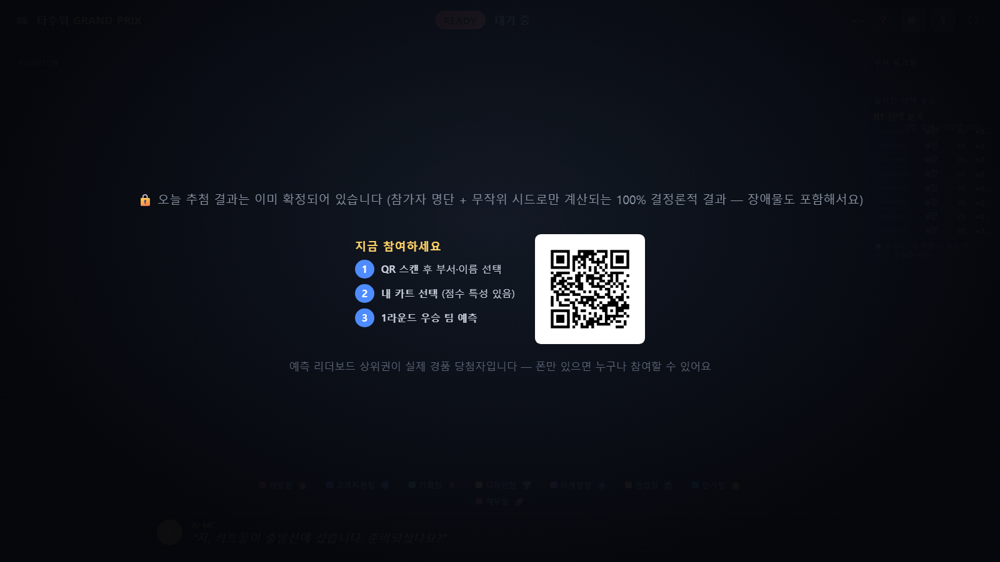
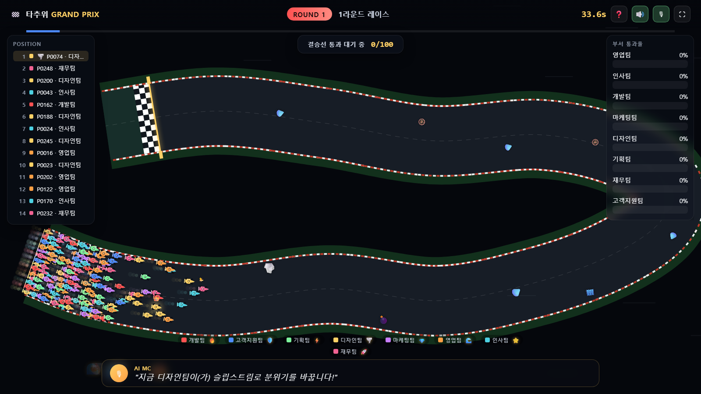
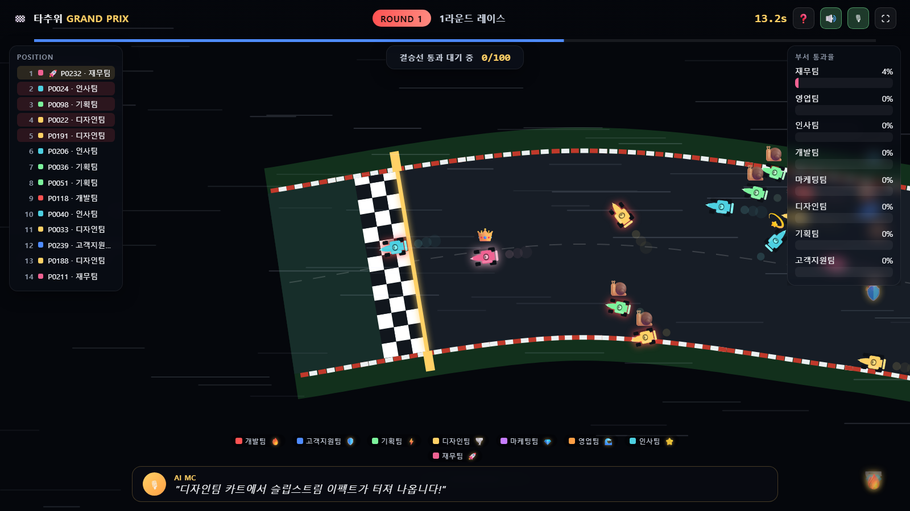
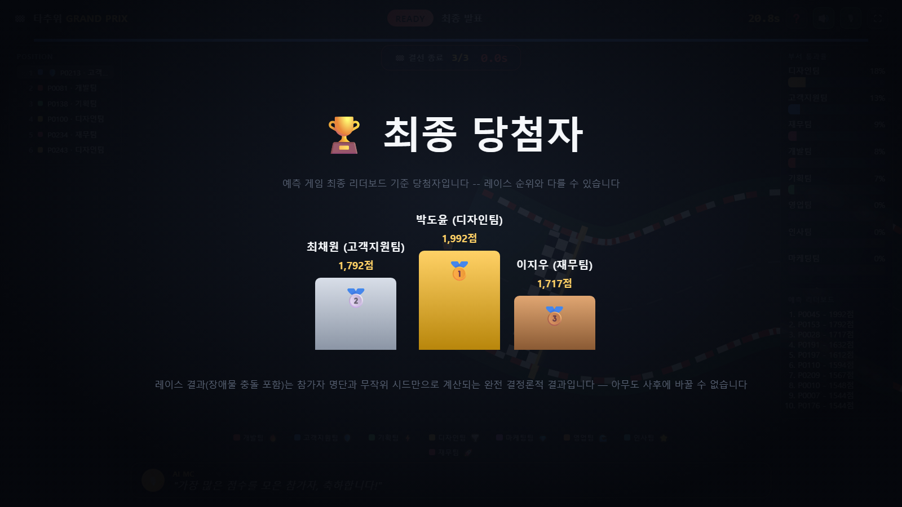
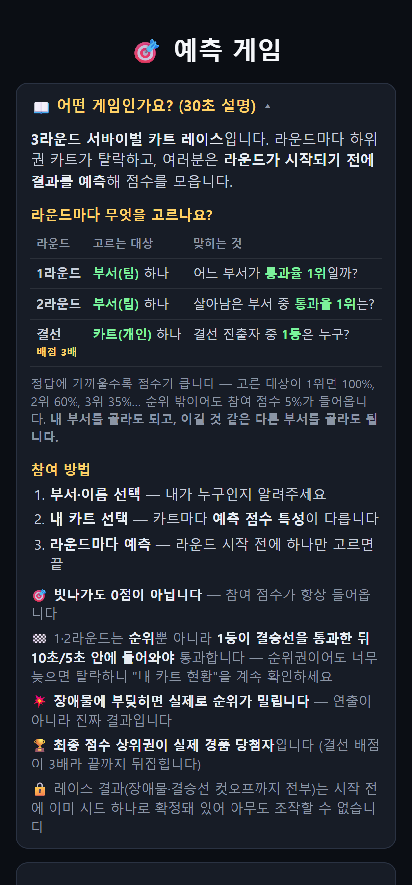
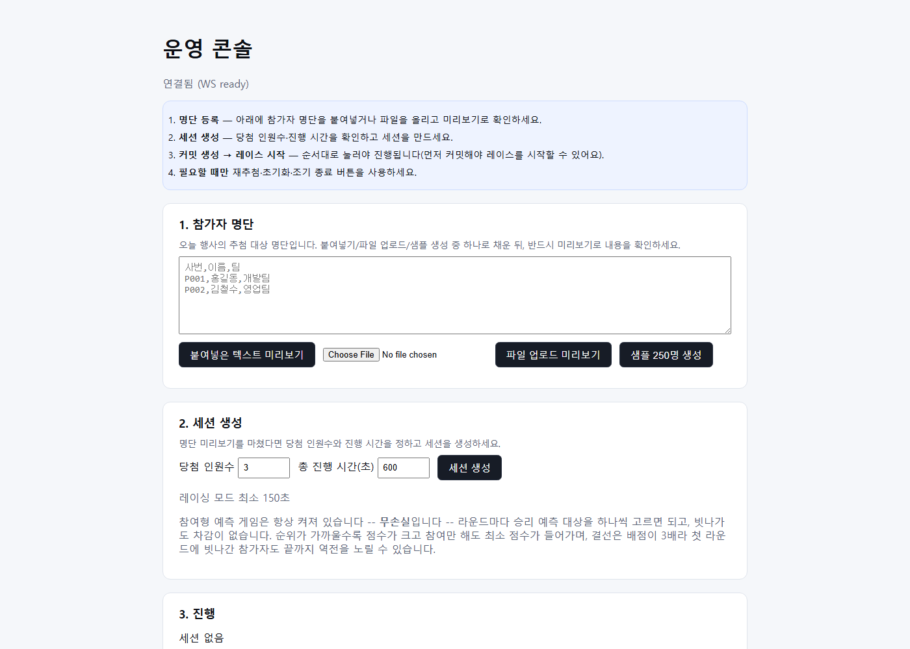

# 🎉 타추위 추첨 프로그램

타운홀 미팅용 AI 에이전트 기반 경품 추첨 서비스. 250명 규모 참가자를 대상으로
**10분 안에** 진행되는, 시드 하나로 완전히 결정론적인 공정한 레이스 +
부서 대항 카트 레이싱 연출 + 참여형 예측 게임을 제공합니다. **예측
게임을 켜면 그 최종 리더보드가 실제 경품 당첨자를 정합니다** — 레이스는
여전히 참가자 명단과 무작위 시드만으로 100% 결정론적으로 고정되지만,
막판까지 누가 상품을 받을지 알 수 없는 반전이 핵심 재미 포인트입니다.

> 저장소: https://github.com/evan-dongmin/Lucky_draw_Service
> 배포 주소: https://taachuwi-grandprix.onrender.com/ (무대 화면, Render.com
> 무료 플랜 — 트래픽이 없으면 슬립되므로 접속 후 첫 응답이 몇십 초 걸릴 수
> 있습니다)
> 운영 콘솔: https://taachuwi-grandprix.onrender.com/admin
> 그 외 같은 도메인에서 바로 접속 가능: `/mobile`(참여)

> **문서 안내**
> - **`타추위-추첨프로그램_게임구조.md`** — 게임 진행 순서·라운드별 규칙·
>   보상표·바꾸기 쉬운 설정값을 한눈에 정리한 **기준 문서**. "무엇을 어떻게
>   바꿀지" 판단할 때 여기부터 보세요.
> - `타추위-추첨프로그램_게임소개.md` — 참가자·행사 진행자용 쉬운 설명.
> - `타추위-추첨프로그램_기획안.md` — 설계 배경과 의사결정 근거.
> - `타추위-추첨프로그램_작업계획서.md` — 개발 실행 계획.
> - `타추위-추첨프로그램_진행상황.md` — 개발 이력과 다음 할 일.
> - 이 README는 개발자/심사자용 기술 문서입니다.

---

## 1. 30초 만에 체험하기 (심사자용 원클릭 데모)

1. [실행](#4-실행-방법)한 뒤 브라우저에서 **무대 화면**(기본 접속 주소)을 엽니다.
2. **"🚀 데모로 체험하기"** 버튼을 누릅니다.
   - 가상 참가자 250명 + 부서가 자동 생성되고,
   - 레이싱+예측 게임 세션이 만들어져 커밋이 즉시 공개되며,
   - 예측 봇 249명이 자동으로 참여해 분포·리더보드를 채우고,
   - 10분 런북이 자동으로 시작됩니다.
3. 별도 브라우저 창에서 `/mobile`을 열어 직접 부서·이름을 선택하고 예측에
   참여해볼 수 있습니다(자기 자신도 봇들 사이에서 함께 경쟁).
4. 10분 후 실제 당첨자(기본 데모는 예측 게임 켜짐 → 최종 예측 리더보드
   상위 N명)가 시상대에 발표됩니다. 레이스 결과(장애물 충돌까지 포함)는
   시작 전에 이미 시드 하나로 100% 결정론적으로 정해져 있었습니다.

---

## 1-1. 화면 미리보기

아래 이미지는 모두 **실제로 구동한 서비스**를 헤드리스 브라우저(Playwright)로
250명 세션을 돌리며 캡처한 것입니다(`docs/screenshots/`).

| 무대 — 출발 준비(커밋 완료 + QR) | 무대 — 1라운드 레이스(250대) |
|---|---|
|  |  |

| 무대 — 선두 추적(장애물·결승선) | 무대 — 최종 경품 당첨자 시상대 |
|---|---|
|  |  |

| 참가자 폰 — 게임 소개·참여 | 운영 콘솔 |
|---|---|
|  |  |

---

## 1-2. 공모 요구사항 대응표

공모 안내문(`타추위-추첨프로그램 설명.txt`)의 **개발 고려사항**을 항목별로
어디서 충족하는지 정리했습니다.

| 요구사항 | 구현 | 확인 위치 |
|---|---|---|
| 결과 공개 전까지 긴장감·기대감을 높이는 연출 | 커밋으로 결과를 먼저 봉인 → 3라운드 서바이벌 카트 레이스(F1 스타트 라이트·포지션 타워·장애물·결승선 컷오프 카운트다운·AI MC 음성 해설·시상대) → **결선이 끝난 뒤 예측 리더보드로 당첨자를 한 번 더 뒤집는 2단 발표** | 무대 화면 `/`, 위 스크린샷 |
| 250명 규모 데이터의 안정적 처리 | 250명 기준으로 설계·검증. 무대에만 위치를 브로드캐스트하고 폰은 1인분만 폴링해 계산 | `scripts/load_test.py --count 250`(WS 250 동시 접속 + 동시 참여 지연시간 측정) |
| 현장에서 누구나 이해·사용하는 직관적 화면 | 운영 콘솔은 번호가 매겨진 4단계(명단→세션→커밋·시작→필요 시 재추첨). 무대·폰 양쪽에 게임 소개와 참여 방법 3단계를 상시 노출, 레이스 중에도 ❓ 버튼으로 재확인 | `/admin`, 무대 ❓ 패널, `/mobile` 접이식 소개 |
| 결과의 공정성·신뢰성을 확인할 수 있는 구조 | 명단+시드만으로 **순위·통과자·당첨자·장애물 충돌·컷오프까지 100% 결정론적**으로 계산하고, 추첨 전에 SHA-256으로 커밋(봉인). 같은 시드·스냅샷을 다시 넣으면 항상 같은 결과가 나오는지 재계산으로 검증 | `app/fairness.py: build_snapshot`/`recompute_from_reveal`/`verify_draw`, `tests/test_fairness.py`(위변조 탐지 테스트 포함) |
| 명단을 간편하게 등록 (이름/사번/별칭) | 붙여넣기 · CSV/XLSX 파일 업로드 · 샘플 250명 자동 생성 3가지. 헤더명은 `사번/id/번호`, `이름/성명/name`, `팀/부서/department` 등 별칭을 자동 인식하고, 등록 전 미리보기로 확인 | `app/roster.py: _HEADER_ALIASES`, `/admin` 1단계 |
| 중복 당첨 방지 / 당첨자 제외 | **재추첨 시 "이전 당첨자 제외" 체크박스**(기본 켜짐)로 이미 당첨된 인원을 빼고 다시 뽑습니다. 특정 인원을 아예 제외하려면 사번을 넣어 **제외 적용** | `/admin` 3·4단계, `POST /api/draw/redraw`의 `exclude_previous_winners` |
| PC·대형 스크린에서 원활한 실행 | 무대 화면은 프로젝터 기준 전체화면 Canvas 렌더링(⛶ 버튼). 화면 폭에 따라 좌우 패널이 접히고, 트랙은 월드+카메라 방식이라 해상도가 달라도 카트 크기가 유지됨 | `/`, `static/stage.js: computeCamera` |
| 안정적 실행 + 초기화·재추첨 | **전체 초기화**(세션·예측·스냅샷 전부 리셋)와 **재추첨**을 운영 콘솔에서 바로 실행. 진행이 밀리면 **비상 조기 종료**로 현재 레이스만 건너뜀. 서버가 재시작돼도 스냅샷에서 상태 복원 | `POST /api/session/reset`, `/api/draw/redraw`, `/api/racing/fast-forward`, `tests/`의 상태 복원 테스트 |
| Input 250명(이름·팀·사번) + 추첨 인원수 / Output 당첨자 N명 | 명단과 **당첨 인원수**를 입력받아, 정확히 그 인원수만큼 최종 당첨자를 산출(컷오프가 아무리 타이트해도 정원은 항상 채워지도록 안전장치) | `app/fairness.py: _apply_cutoff_window`(정원 보장), 무대 시상대 + 운영 콘솔 "실제 경품 당첨자" |

---

## 2. 화면 구성

| 주소 | 대상 | 내용 |
|---|---|---|
| `/` | 대형 스크린(무대) | 부서 통과율 랭킹, 레이스 진행(장애물 포함), 예측 리더보드, 최종 당첨자 |
| `/admin` | 운영자(사회자) | 명단 등록(붙여넣기·CSV/XLSX 업로드·샘플 생성), 당첨 인원수·진행 시간 설정, 특정 인원 제외, 커밋→레이스 시작→재추첨(이전 당첨자 제외)·전체 초기화, 비상 조기 종료, **실제 경품 당첨자 확인** |
| `/mobile` | 참가자 개인 폰 (QR 접속) | 부서→실명 2단계 참여, 예측 카드(라운드마다 대상 하나씩 선택), **내 카트 현황**(실시간 등수·통과 여부·통과선까지 진행률·팀 순위·포인트 순위) |

---

## 3. 핵심 기능

### 공정성 (시드 기반 완전 결정론) — "레이스 결과"에 대한 보장
- 명단·부서 편성·당첨 인원수를 시드와 함께 커밋(SHA-256)해 추첨 **전**에
  내부적으로 확정합니다(운영 콘솔·무대 화면에 해시값 자체를 노출하지는
  않습니다 — 사용자 요청으로 2026-08-08에 뺐습니다).
- **순위·통과자·당첨자뿐 아니라 장애물(누가 언제 어떤 장애물에 맞아 얼마나
  밀리는지)과 결승선 컷오프(1·2라운드, 아래 참고)까지 전부 이 시드
  하나에서 결정론적으로 파생됩니다**
  (`app/race.py: obstacle_layout`/`lane_for`/`crossing_ratio`,
  `app/fairness.py: _obstacle_adjusted_ranking`/`_apply_cutoff_window`).
  레이스 애니메이션은 이렇게 이미 확정된 결과로 수렴하는 연출일 뿐이라,
  누구도(운영자 포함) 레이스 도중 결과에 개입할 수 없습니다.
- 예전에는 `/verify` 페이지에서 브라우저가 서버와 별개로 커밋·순위를
  재계산해 사후 대조하는 방식으로 이 결정론을 시연했습니다. 사용자
  요청으로 그 화면은 뺐지만(`static/verify.html`·`static/fairness.js`
  삭제), 판정 로직 자체는 여전히 시드 하나만으로 100% 재현 가능한 순수
  함수입니다(`app/fairness.py: recompute_from_reveal`/`verify_draw` —
  같은 seed+snapshot을 다시 넣으면 항상 같은 커밋·순위가 나오는지
  검증하는 내부 유틸로 남아 있고, `tests/test_fairness.py`의 위변조
  탐지 테스트가 이를 계속 확인합니다).
- **예측 게임이 켜진 세션에서는 이 레이스 결과 자체가 실제 경품
  당첨자는 아닙니다** — 아래 "참여형 예측 게임" 절 참고. 레이스가
  공정해야 그 위에서 벌어지는 예측 게임도 의미가 있으므로, 이 결정론은
  여전히 전체 신뢰 구조의 토대입니다.

### 3라운드 부서 대항 서바이벌 퍼널
- R1: 전원 출발 → 순위 상위 100명 후보 중 **1등 결승 통과 후 10초 안에
  들어온 카트만** 통과 (부서별 통과율 실시간 집계)
- R2: 생존자 중 순위 상위 결선 진출 후보(F명) 중 **1등 결승 통과 후
  5초 안에 들어온 카트만** 통과
- 순위 조건과 시간 조건 둘 다 만족해야 통과하는 AND 조건이며, 아무리
  좁게 걸려도 다음 라운드/최종 당첨자 정원은 항상 채워지도록 안전장치가
  있습니다(자세한 내용은 게임구조 문서 §3 "결승선 컷오프" 참고).
- R3: 결선 → 도착 순서로 레이스 순위 확정. **1등이 결승선을 통과하면
  5초 카운트다운이 돌고, 끝나는 순간 레이스를 마치고 곧바로 결과
  발표로 넘어갑니다**(이미 승부가 갈린 뒤 뒤처진 카트를 계속 보지 않아도
  됩니다). 당첨자 자체는 순위로 정해집니다 — 결선 결승선은 애초에
  "정확히 N대가 넘도록" 놓이므로 창을 좁혀도 당첨자는 바뀌지 않습니다.
  예측 게임이 꺼져 있으면 이 순서가 곧 최종 당첨자 N명이고, 켜져 있으면
  아래 예측 게임 리더보드가 최종 당첨자를 정합니다
- **생존은 항상 개별 참가자 단위로 결정**되고, 부서 순위는 그 결과를 집계한
  표시·예측용 지표일 뿐입니다(부서 통째 탈락 없음 → 레이스에서 중간에
  사라지는 모순이 구조적으로 발생하지 않습니다).
- 트랙은 **라운드마다 성격 자체가 다른 코스**입니다 — R1은 넓고 완만한
  고속 스피드웨이(250대가 한 화면에 들어와야 함), R2는 폭이 절반으로
  좁아진 지그재그 시케인, R3는 가장 좁고 굴곡이 심한 테크니컬 서킷.
  차선 수도 트랙 폭에 맞춰 자동 조정돼 좁은 코스에서 카트가 점처럼
  작아지지 않습니다.
- 참가자는 모바일에서 **응원 이모지**(🔥👏🎉 등)를 눌러 무대 화면에 가볍게
  띄울 수 있습니다(순수 연출, 순위에 영향 없음, 서버가 도배 방지 쿨다운
  적용).
- **무대 화면(전체화면 레이싱 중계)**: 부서 색상 카트가 **직선 구간을
  헤어핀으로 이어 붙인 진짜 서킷**(웨이포인트를 2차원으로 찍은 Catmull-Rom
  스플라인, 노면 밖 잔디·런오프까지)을 진행 방향에 맞춰 회전하며 달리는
  Canvas 렌더링. 트랙은 화면보다 큰 **월드** 위에 그려지고 카메라가
  따라갑니다 — 라운드마다 코스가 확실히 다르되(R1 롱 스트레이트 / R2
  S자 시케인 / R3 연속 시케인), 체감 속도는 세 라운드가 비슷하도록
  정규화돼 있습니다. **1라운드 출발 전 스타팅 그리드**(3열 스태거드
  정렬) → **실제 그랑프리 절차를 그대로 따르는 F1 스타트 라이트**(5열×2단
  갠트리에 빨간 등이 하나씩 점등 → **언제 꺼질지 모르는 불규칙한 정적**
  → 일제 소등 = 출발. **라이트가 끝나야 실제로 출발합니다**)
  → 레이스 순으로 이어집니다. 카메라는 **처음엔 코스 전체를 보여주다가
  진행률에 따라 선두 집단으로 부드럽게 줌인**하고(admin에서 수동 전환도
  가능), 뒤처진 카트는 화면 밖으로 자연스럽게 빠집니다.
  **8종 장애물**(콘🚧·기름통🛢️·타이어🛞·바나나🍌·웅덩이💧·바위🪨·폭탄💣·얼음🧊)이
  **결승선까지 가는 구간에만 고른 간격으로** 놓이고 좌우로 흔들리며
  회전합니다(움직임까지 전부 시드에서 파생돼 관전 화면이 몇 대든 똑같이
  움직입니다),
  부딪히면 **눈에 띄게 뒤처졌다가 따라잡는 감속·스핀아웃·코스 이탈**
  연출이 걸립니다(**순수 시각 효과 — 순위·진행률 값은 절대 바뀌지
  않고, 결승선 직전 구간에서 모든 효과가 0으로 수렴해 보이는 위치와
  실제 위치가 정확히 일치합니다**). **결승선을 넘는 것이 곧 통과·승리
  기준**이며, 라운드·인원수와 무관하게 항상 트랙 끝 가까이에 큼직한
  체커기 게이트로 그려지고 그 너머에는 장애물이 생기지 않습니다.
  근접한 순위끼리는 화면에서 계속 앞서거니 뒤서거니 하며
  선두가 자주 바뀌어 보이는 잔물결 연출도 더해져 있습니다(이 역시
  실제 순위에는 영향 없음). 실시간 포지션 타워, 순위 역전 시 팀 특수능력 아이콘
  이펙트, **장면마다 다른 합성 배경음악 7종**(대기 · 출발 대기 · 선택창 ·
  **라운드별 레이스 BGM 3종** — 디튠 톱니 스택 + 4분 킥 + 16분 하이햇으로
  라운드가 올라갈수록 빨라지고 무거워집니다 ·
  결과 발표·시상대)과 상황별 WebAudio 효과음(**장애물 충돌 6종** ·
  **결승선 통과** — 선두는 체커기+함성 · 마지막 랩 종 · 발표 직전 상승음 ·
  팡파레. 둘 다 외부 음원 파일 없이 오실레이터로
  즉석 합성 — 오프라인/불안정한 네트워크에서도 항상 재생), AI MC 실시간
  **남성 스포츠 캐스터 톤** 음성 해설(Web Speech API, 상황 태그별 속도·피치 프로파일과 발화마다
  미세한 무작위 지터로 단조로운 낭독 느낌을 줄임), 최종 발표 시 시상대+
  컨페티+팡파레, 진행이 밀릴 때 관리자가 현재 레이스만 조기 종료하는
  비상 버튼. 모두 이미 서버가 계산한 결과를 "극적으로 보여주는" 연출일
  뿐이며 공정성 판정 자체에는 관여하지 않습니다.
- **캐릭터/카트 선택 — 점수에 영향을 주는 실제 선택지**: 참가자가 모바일
  온보딩(부서→이름 선택 다음 단계)에서 니트로 부스트·배리어 실드 등
  8종 중 자기 카트를 직접 고릅니다(게임 화면에서 언제든 재선택 가능).
  카트마다 **예측 점수 규칙을 비트는 특성**이 다릅니다 — 1라운드 예측
  +25%, 순위 밖일 때 참여 점수 2배, 1위 정확 적중 +15%, 팀 순위 보상
  +50%, 결선 예측 +20% 등. **단, 레이스 순위·통과 여부에는 어떤 영향도
  주지 않습니다.** 능력은 사람이 고르는 값이라 순위에 영향을 주는 순간
  "능력 잘 고른 사람이 유리한 추첨"이 되어 공정성이 깨지기 때문입니다.
  최종 결과는 여전히 시드로 완전히 고정됩니다. 배수 폭도 주력 ±30%
  이내로 제한해 "무엇을 맞혔는가"가 "무엇을 골랐는가"보다 중요하도록
  유지합니다. 고르지 않으면 부서 기준 고정 배정으로 폴백하되 **점수
  배수는 붙지 않습니다**(안 고른 사람이 우연히 유리해지지 않도록).
  카트 몸체 색은 항상 부서색을 유지합니다(팀 우열을 한눈에 보기 위한 정보).
- **예측에 필요한 판단 지표를 폰과 무대에 함께 표시**: 라운드마다
  근거가 달라서, R1은 팀별 참가 카트 수, R2는 살아남은 카트 수와 직전
  통과율·순위, R3는 결선 진출자의 직전 등수와 소속 팀을 보여줍니다.
  무대는 선택 창 동안 화면 중앙 패널로, 폰은 후보 버튼에 직접 붙여
  큰 화면을 못 보는 사람도 같은 정보로 고를 수 있게 했습니다.
- **레이스 시작 전 게임 소개**: 무대 대기·커밋 화면에 "이런 게임입니다"와
  "참여 방법 3단계"를 QR과 함께 띄우고, 모바일에도 접이식 소개를 두어
  처음 보는 사람이 10초 안에 파악할 수 있게 했습니다.

### 참여형 예측 게임 — 이 리더보드가 실제 경품 당첨자를 정합니다
**운영 콘솔에서 만드는 세션은 예측 게임이 항상 켜진 상태입니다**(무손실
게임이라 끌 이유가 없어 조작 단계를 하나 줄였습니다). 끄는 경로 자체는
API(`POST /api/session`의 `predictions_enabled: false`)에 남아 있고,
꺼진 세션은 레이스 결과가 곧 당첨자가 됩니다(테스트로 회귀 없음을
계속 확인합니다). **켜져 있으면 "누가 상품을 받는가"의 정의 자체가
달라집니다**:

> **실제 경품 당첨자 = 레이스 종료 시점(라운드 3 최종 채점 완료 후)의
> 예측 게임 리더보드 상위 N명**(N = 원래 설정한 당첨 인원수). 레이스
> 자체는 여전히 시드 하나로 완전히 결정론적으로 고정되지만,
> **결선 1등이 곧 최종 승자라는 보장은 없습니다.** 리더보드는 라운드가
> 끝날 때마다 계속 뒤집힐 수 있고, 진짜 순위는 결선이 끝나고 마지막
> 채점이 반영되는 그 순간까지 아무도 알 수 없습니다 — 마지막까지 긴장을
> 놓을 수 없게 하기 위한 의도된 설계입니다. 예측 게임이 꺼져 있으면
> 리더보드가 없으므로 레이스 결과가 곧 당첨자입니다. **모바일로
> 참여하지 않은 사람도 당첨
> 대상입니다** — 커밋 시점에 명단 전원의 예측 카드가 만들어지고(`enroll_all`),
> R1·R2는 자기 소속 부서가 자동 선택되기 때문입니다. 다만 직접 고른
> 사람이 통계적으로 리더보드 위로 올라가므로, 진행자는 "QR로 참여하면
> 훨씬 유리합니다"라고 안내하세요.

**돈을 걸거나 잃는 요소는 없습니다.** 빗나가도 차감이 없는 순수 예측
게임입니다.

- **라운드당 1픽**: 참가자는 라운드마다 승리 예측 대상(부서 R1·R2 /
  결선 카트 R3)을 하나씩 고릅니다. **틀려도 차감 없음.** (예전엔 확신도
  100점을 3라운드에 직접 배분해야 했지만, 선택 창이 짧게 열리는 라이브
  이벤트에는 불필요한 마찰이라 판단해 없앴습니다 — 라운드마다 같은
  배점을 걸고 겨루는 지금 방식이 더 직관적입니다.)
- **순위 차등 채점**: 고른 대상이 그 라운드 결과 순위에서 몇 등이었는지에
  따라 배점의 **100 / 60 / 35 / 20 / 10%** 를 받고, 순위표 밖이어도
  **5%(참여 보상)** 가 들어갑니다(`RANK_RATIOS`, `FLOOR_RATIO`).
  라운드 배점은 `ROUND_BASE_POINTS(300) × 라운드 가중치`라서 1위 적중은
  **R1 300 / R2 450 / R3 900점**입니다. **아무도 0점이 아니되**, 1위
  적중과 꼴찌 사이 20배 격차로 변별력은 유지됩니다. 1위를 정확히 맞힌
  경우에 한해 소수파 보너스(최대 2배)가 붙습니다. **직접 고른 라운드는
  예측 점수에 40%가 추가로 붙습니다**(`MANUAL_PREDICT_MULTIPLIER`,
  자동 배정도 100%는 그대로 받으므로 손해는 없음). 전체 점수표는
  게임구조 문서 §5 참고.
- **결선(R3) 배점 3배**: 라운드 가중치가 1.0 / 1.5 / **3.0** 으로 커져서,
  앞 두 라운드를 모두 1위로 맞힌 사람도 결선 하나로 뒤집힐 수 있습니다
  (`ROUND_WEIGHTS`). 개인이 무언가를 몰아주지 않아도 결선이 가장
  중요한 라운드가 되도록 배점 자체에 이미 반영돼 있는 구조입니다.
- **성과 점수**(예측 적중과 무관): 라운드 통과 +20, 그 라운드 통과율
  1~3위 부서 소속 통과자에게 +45 / +30 / +18, 결선 최종 당첨자 +150.
  라운드가 끝날 때마다 참가자 폰에 "이번 라운드에 몇 점을 왜 받았는지"가
  항목별로 소계·총계와 함께 표시됩니다.
- **내 카트 현황**: 레이스가 실제로 달리는 동안 폰 화면에 **내 카트의
  실시간 등수, 통과선 통과 여부(진행 중이면 통과선까지 몇 % 왔는지
  진행률 바로 표시), 소속 팀의 실시간 순위, 포인트(=예측 적중 +
  성과 점수 누적) 순위**가 카드로 뜹니다. 서버는 250명 전원에게 매
  프레임 위치를 뿌리지 않고(그건 무대 화면 전용) 폰이 2초 간격으로
  폴링할 때마다 그 사람 한 명분만 계산해 돌려주는 방식이라, 인원이
  많아도 서버 부담이 커지지 않습니다.
- 대상 선택은 **해당 라운드의 선택 창이 열린 동안에만** 가능합니다(미리
  걸어두고 잊는 것을 방지). 시간 내 미선택 시 자동 배정되는데, 규칙이
  라운드마다 다릅니다 — **R1·R2는 자기 소속 부서**(대상이 부서라 가장
  자연스러운 기본값), **R3는 커밋된 시드에서 파생된 무작위**(결선
  진출자 개인이 대상이라 "자기 팀"에 해당하는 것이 없음).

### AI MC 에이전트
- 상황별(오프닝/레이스 진행/부서 순위 변동/라운드 통과/최종 발표/시상 축하) 멘트를
  자동 진행 중 자막으로 노출합니다.
- **행사 전 사전 배치 생성만** 하며 레이스 도중 실시간 LLM 호출은 하지
  않습니다. `XAI_API_KEY`(xAI Grok, 우선 사용)로 호출하고 실패/한도 초과 시
  `GEMINI_API_KEY`(Google Gemini)로 자동 대체합니다. 둘 다 없거나 둘 다
  실패해도 정적 폴백 멘트로 완전히 동작합니다.
- 실명·사번·부서명은 절대 외부 API로 전송하지 않습니다(익명 슬롯 템플릿만
  생성 요청 → 실제 값은 로컬에서 치환).

---

## 4. 실행 방법

```bash
python -m venv .venv
# Windows: .venv\Scripts\activate  /  macOS·Linux: source .venv/bin/activate
pip install -r requirements.txt
python run.py
```

브라우저가 자동으로 열립니다(기본 `http://127.0.0.1:8000/`). `XAI_API_KEY` /
`GEMINI_API_KEY` 환경변수를 설정하면 MC 멘트를 LLM으로 사전 생성할 수 있으며,
없어도 전 기능이 정상 동작합니다.

같은 Wi-Fi의 다른 기기에서 모바일 화면에 접속하려면 서버 PC의 사설 IP로
접속하세요 (예: `http://192.168.0.10:8000/mobile`). `HOST` 환경변수를
`0.0.0.0`으로 설정하면 외부 접속을 허용합니다.

### 배포(선택)

`Dockerfile`과 `render.yaml`을 포함해두었습니다. Render.com 기준으로는
대시보드에서 "New +" → "Blueprint" → 이 저장소를 선택하면 별도 설정 없이
배포됩니다(웹소켓 지원 확인됨). 무료 플랜은 트래픽이 없으면 슬립되므로,
행사 당일에는 시작 10~15분 전에 한 번 접속해 깨워두는 것을 권장합니다.
행사 PC에서 로컬로 실행하는 것도 여전히 가장 안전한 방식이며(네트워크
불확실성이 없음), 배포 주소는 원격 심사자가 사전에 미리 체험해볼 수
있게 하는 보조 수단으로 추천합니다.

**실제 배포 주소**: https://taachuwi-grandprix.onrender.com/ (위 방식으로
이미 배포되어 있습니다. `/mobile`, `/admin`도 같은 도메인
경로로 바로 접속됩니다.)

### 운영자 진행 순서 (실제 행사용)

1. `/admin`에서 명단을 붙여넣기/업로드하고(또는 샘플 생성), 미리보기로
   확인한 뒤 당첨 인원수·총 진행 시간(기본 600초)을 설정 →
   **세션 생성** (레이싱 모드 + 예측 게임 켜짐으로 진행됩니다).
   특정 인원을 이번 추첨에서 빼려면 "제외할 참가자 ID"에 사번을 적고
   **제외 적용**을 누릅니다.
2. **① 커밋 생성** — 결과가 내부적으로 확정(봉인)되고, 무대 화면에
   "출발 준비" 화면이 뜹니다. 이 시점부터 모바일 R1 선택 창이
   열립니다(온보딩 겸용).
3. **② 레이스 시작**을 누르면 10분 런북이 자동 진행됩니다.
4. 필요 시 **재추첨**(이전 당첨자 제외 옵션) 또는 **전체 초기화**.

---

## 5. 테스트

```bash
pytest -q
```

320개 테스트가 공정성 엔진의 결정론·위변조 탐지, 부서 통과율 계산,
레이스 판정과 Fairness 결과 100% 일치(다수 시드 반복 검증), **장애물이
실제로 순위를 바꾸는지 + 항상 결승선에서 정확히 목표 위치로 수렴하는지**
(§12-4), **1·2라운드 결승선 컷오프가 실제로 통과자를 걸러내면서도
다음 라운드/최종 당첨자 정원은 항상 채우는지**(§12-8), 예측 게임의
**순위 차등 채점**(순위별 단조 감소·참여 보상
하한·소수파 보너스 적용 범위·결선 배점 3배로 인한 막판 역전)과 선택창
상태머신, **미선택 시 자동 배정 규칙**(R1·R2 자기 부서 / R3 무작위),
**최종 경품 당첨자가 예측 게임 최종 리더보드에서 정확히 뽑히는지(레이스
순위와 달라질 수 있는 케이스 포함)**, 서버 재시작 후 상태 복원, 예측
게임 off 상태에서의 회귀 없음 등을 검증합니다.

### 부하 테스트(시뮬레이션)

실제 250대 물리 기기·행사장 Wi-Fi 환경은 이 개발 환경에서 재현할 수 없어,
asyncio 기반 스크립트로 그 부하 패턴을 시뮬레이션합니다:

```bash
python run.py &          # 서버 실행
python scripts/load_test.py --count 250
```

WebSocket 250개 동시 접속 + 250명 동시 참여(join)·1라운드 선택
요청에 대한 성공률과 지연시간(p50/p95/max)을 출력합니다. **행사 전에는 반드시
실제 기기·행사장 네트워크로도 실측하는 것을 권장합니다.**

---

## 6. 프로젝트 구조

```
app/            FastAPI 백엔드 (fairness, director, race, mc, predictions, main)
static/         프런트엔드 (stage/admin/mobile) -- 순수 HTML/CSS/JS
tests/          pytest 테스트 스위트
scripts/        부하 테스트 등 운영 보조 스크립트
data/           런타임 세션·예측 스냅샷 (gitignore, 소스 아님)
```

---

## 7. 오픈소스 라이선스

사용한 모든 오픈소스 패키지와 라이선스는 [THIRD_PARTY_NOTICES.md](THIRD_PARTY_NOTICES.md)에 정리되어 있습니다.
